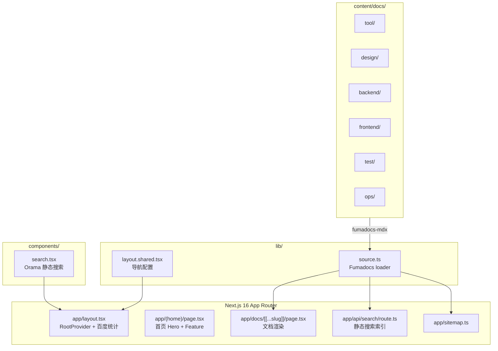

# Stack Reduce (Fumadocs)

> 最后更新：2026-03-06 13:31:08

归纳知识、降低"噪音"的技术文档站点，面向开发团队的技术栈速查与经验分享平台。

## 架构总览

## 模块索引

| 模块 | 路径 | 说明 |
|------|------|------|
| App 路由 | [`app/`](app/) | Next.js 页面、布局、API 路由 |
| 内容 | [`content/docs/`](content/docs/) | 31 个 MDX 文档 + 29 个 meta.json 导航 |
| 组件 | [`components/`](components/) | 共享 React 组件（搜索对话框） |
| 库 | [`lib/`](lib/) | 数据源加载、布局共享配置 |
| CI/CD | [`.github/workflows/`](.github/workflows/) | GitHub Actions 部署流水线 |

## 技术栈

| 层 | 技术 | 版本 |
|----|------|------|
| 框架 | Next.js (App Router, 静态导出) | ^16.1.6 |
| UI | Fumadocs UI + Tailwind CSS 4 | ^16.6.9 |
| 内容源 | Fumadocs MDX | ^14.2.9 |
| 搜索 | @orama/orama (静态模式) | ^3.1.18 |
| 语言 | TypeScript | ^5 |
| 包管理 | pnpm | — |
| 部署 | GitHub Pages + 腾讯云 COS | — |

## 关键配置文件

| 文件 | 作用 |
|------|------|
| `source.config.ts` | Fumadocs MDX collection 定义，指向 `content/docs` |
| `next.config.mjs` | Next.js 配置 + `output: 'export'` 静态导出 + MDX 插件 |
| `tsconfig.json` | TypeScript 配置，含 `fumadocs-mdx:collections/*` 路径别名 |
| `postcss.config.mjs` | Tailwind CSS 4 PostCSS 插件 |
| `mdx-components.tsx` | MDX 全局组件注册（含 Callout） |

## 全局规范

### 内容编写

- 内容文件格式：`.mdx`，放在 `content/docs/` 下
- 每个 `.mdx` 文件必须有 `title` 和 `description` frontmatter
- 每个目录需要 `meta.json` 定义侧边栏顺序和标题
- 顶级分类目录的 `meta.json` 需设置 `"root": true`
- MDX 中不可使用 `<url>` 自动链接语法（会被解析为 JSX），应使用 `[text](url)`
- 提示/警告用 `<Callout>` 组件，不要用 `> [!NOTE]` 语法

### 构建与部署

- `pnpm build` 输出到 `out/` 目录（静态 HTML）
- 搜索使用 `staticGET` 预渲染为静态 JSON
- `sitemap.ts` 需要 `export const dynamic = 'force-static'`
- GitHub Actions：push 到 `main` 触发构建 → GitHub Pages + 腾讯云 COS

### 代码风格

- React 组件使用函数式写法
- 服务端组件为默认，客户端组件需标记 `'use client'`
- 导入路径使用 `@/` 别名指向项目根

## 文件统计

- 源代码文件：13（app 10 + lib 2 + components 1）
- 内容文件：60（MDX 31 + meta.json 29）
- 配置文件：9
- CI/CD：1
- **总计：83 文件**（不含 node_modules、.next、out、.source）
