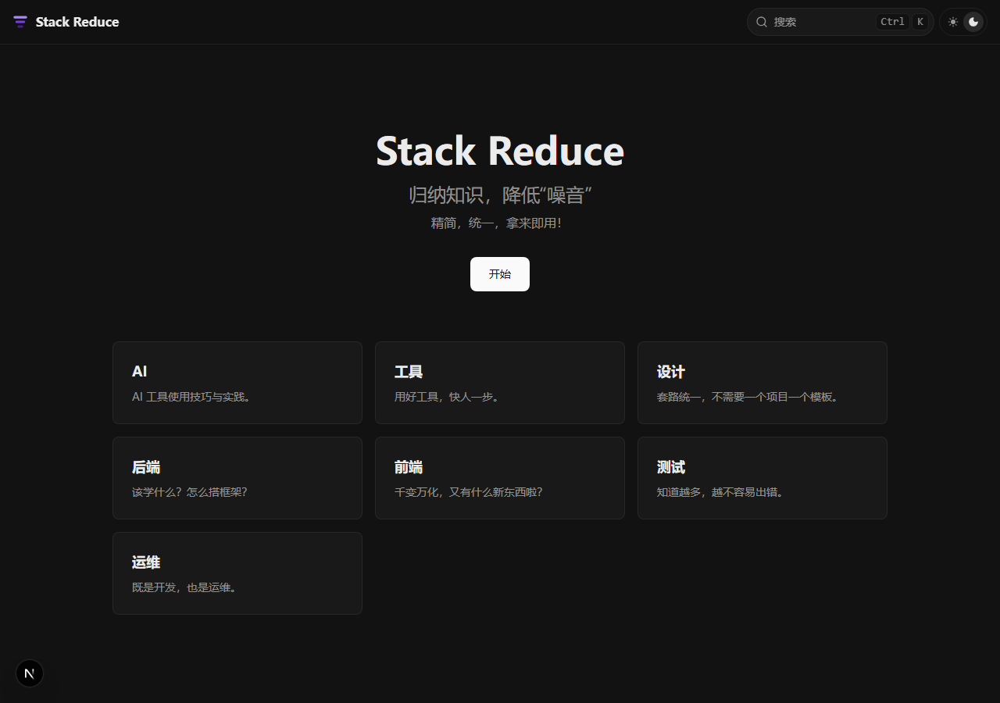

# Stack Reduce

<p align="center">
  <svg xmlns="http://www.w3.org/2000/svg" viewBox="0 0 32 32" width="64" height="64">
    <rect x="2" y="4" width="28" height="5" rx="2.5" fill="#a78bfa"/>
    <rect x="6" y="13.5" width="20" height="5" rx="2.5" fill="#7c3aed"/>
    <rect x="10" y="23" width="12" height="5" rx="2.5" fill="#4c1d95"/>
  </svg>
</p>

<p align="center"><strong>归纳知识，降低"噪音"</strong></p>

<p align="center">面向开发团队的技术栈速查与经验分享平台。精简，统一，拿来即用。</p>

<p align="center">
  <a href="https://stack-reduce.kitlib.cn">在线访问</a>
</p>

## 预览



## 技术栈

| 层 | 技术 | 版本 |
|----|------|------|
| 框架 | Next.js (App Router, 静态导出) | ^16.1.6 |
| UI | Fumadocs UI + Tailwind CSS 4 | ^16.6.9 |
| 内容 | Fumadocs MDX | ^14.2.9 |
| 搜索 | @orama/orama (静态模式) | ^3.1.18 |
| 语言 | TypeScript | ^5 |
| 包管理 | pnpm | — |

## 快速开始

```bash
# 安装依赖
pnpm install

# 启动开发服务器
pnpm dev

# 构建静态站点
pnpm build
```

## 内容结构

所有文档以 MDX 格式存放在 `content/docs/` 下：

```
content/docs/
├── ai/          # AI
├── tool/        # 工具
├── design/      # 设计
├── backend/     # 后端
├── frontend/    # 前端
├── test/        # 测试
└── ops/         # 运维
```

每个目录包含 `meta.json`（定义侧边栏顺序和标题）和 `.mdx` 文档文件。

### 添加新文档

1. 在对应分类目录下创建 `.mdx` 文件，包含 `title` 和 `description` frontmatter
2. 在该目录的 `meta.json` 的 `pages` 数组中添加文件名（不含扩展名）

## 部署

推送到 `main` 分支后，GitHub Actions 自动构建并部署到 GitHub Pages + 腾讯云 COS。

构建产物输出到 `out/` 目录（静态 HTML）。

## License

MIT
