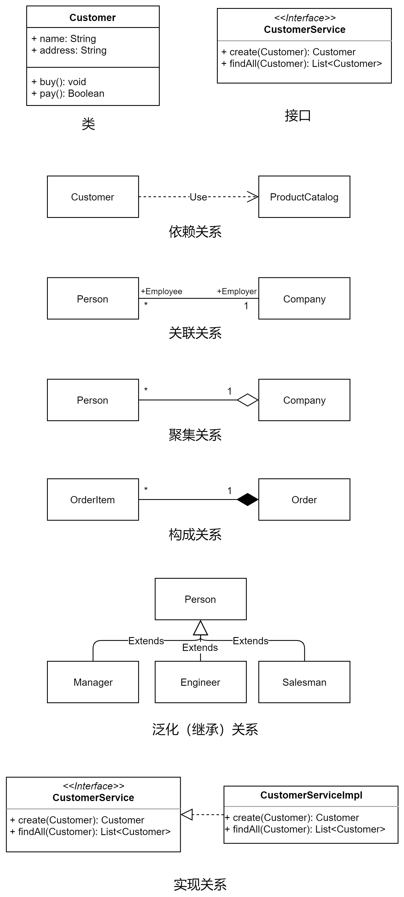

# UML 统一建模语言

> UML 由对象管理组织（[Object Management Group, OMG](https://www.omg.org/)) 修订与维护。  
> UML 规范发布在：<https://uml.org>   
> UML 2.5.1 规范定义文件：[下载地址](https://www.omg.org/spec/UML/2.5.1/PDF)

## 结构建模

- 类图
- 包图
- 对象图
- 构件图
- 部署图

比较常见的是类图，用于描述类的属性和关联关系：

## 行为建模

- 活动图
- 顺序图
- 通信图
- 交互概览图
- 时序图
- 状态图
- 用例图
