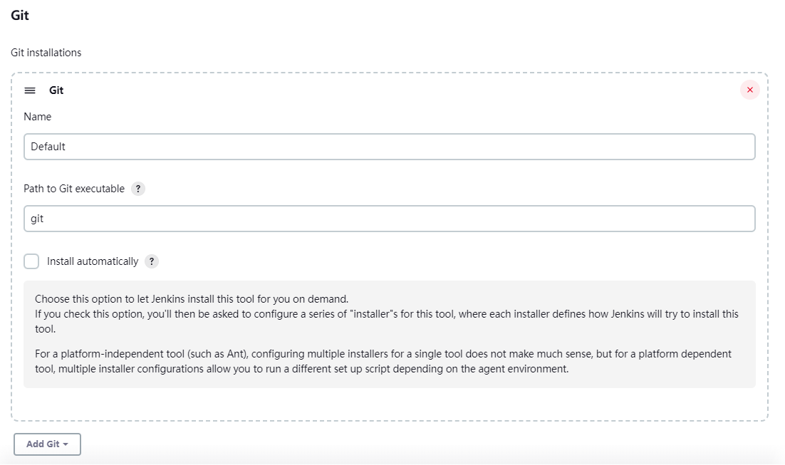
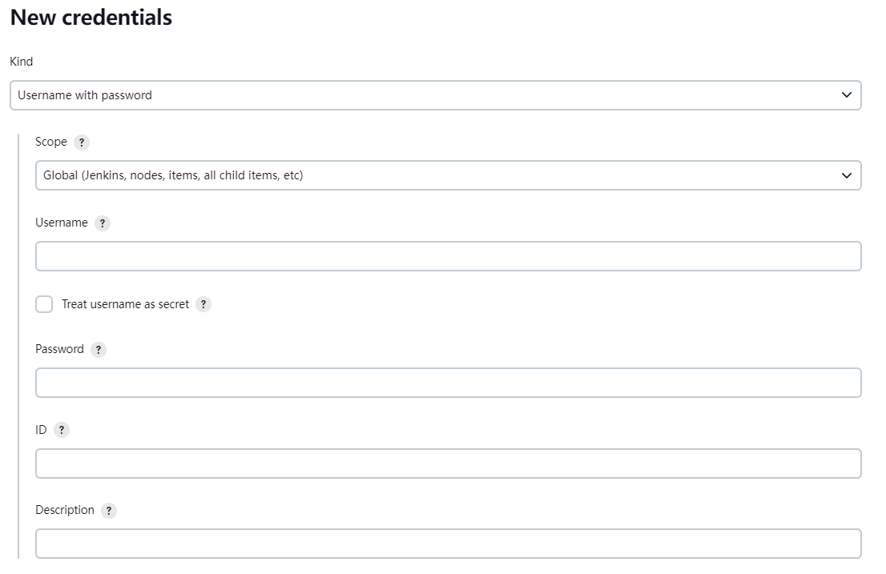
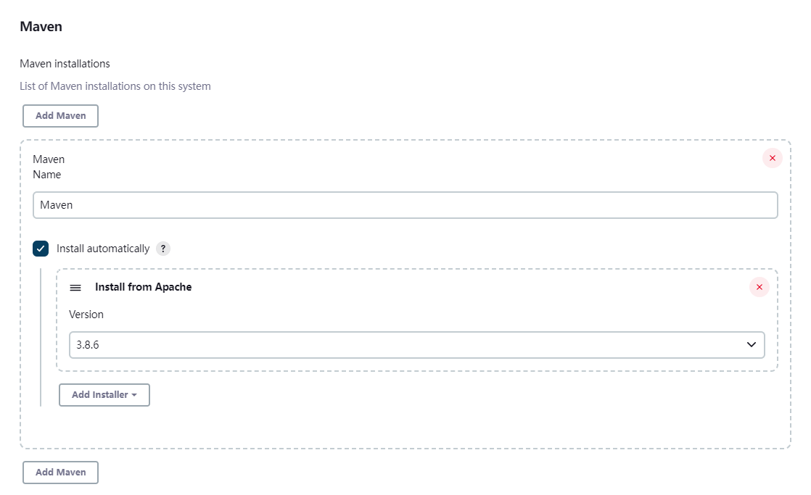

# Jenkins

## 后端

### 自动构建 Maven 项目

#### 1. 安装 Jenkins 插件

进入 `Dashboard / Manage Jenkins / Plugin Manager` 页面，安装下面的插件：

- [Git](https://plugins.jenkins.io/git)
- [Maven Integration](https://plugins.jenkins.io/maven-plugin/)

#### 2. 配置 Git

> 需要先安装好 Git。

进入 `Dashboard / Manage Jenkins / Global Tool Configuration` 页面，配置 Git 命令路径：

设置 Git 远程仓库账号密码或访问密钥：

进入 `Dashboard / Manage Jenkins / Credentials / System / Global credentials (unrestricted)` 页面，添加凭据，例如 Git 账号密码：

#### 3. 配置 Maven

> 不需要提前安装，Jenkins 会自动帮你安装。

进入 `Dashboard / Manage Jenkins / Global Tool Configuration` 页面，配置 Maven 自动安装：

#### 4. 添加任务

TODO

### 自动部署 Jar 应用

## 前端

### 自动构建 NodeJS 项目

#### 1. 安装 Jenkins 插件

进入 `Dashboard / Manage Jenkins / Plugin Manager` 页面，安装下面的插件：

- [Git](https://plugins.jenkins.io/git)
- [NodeJS](https://plugins.jenkins.io/nodejs/)

### 自动部署静态文件
