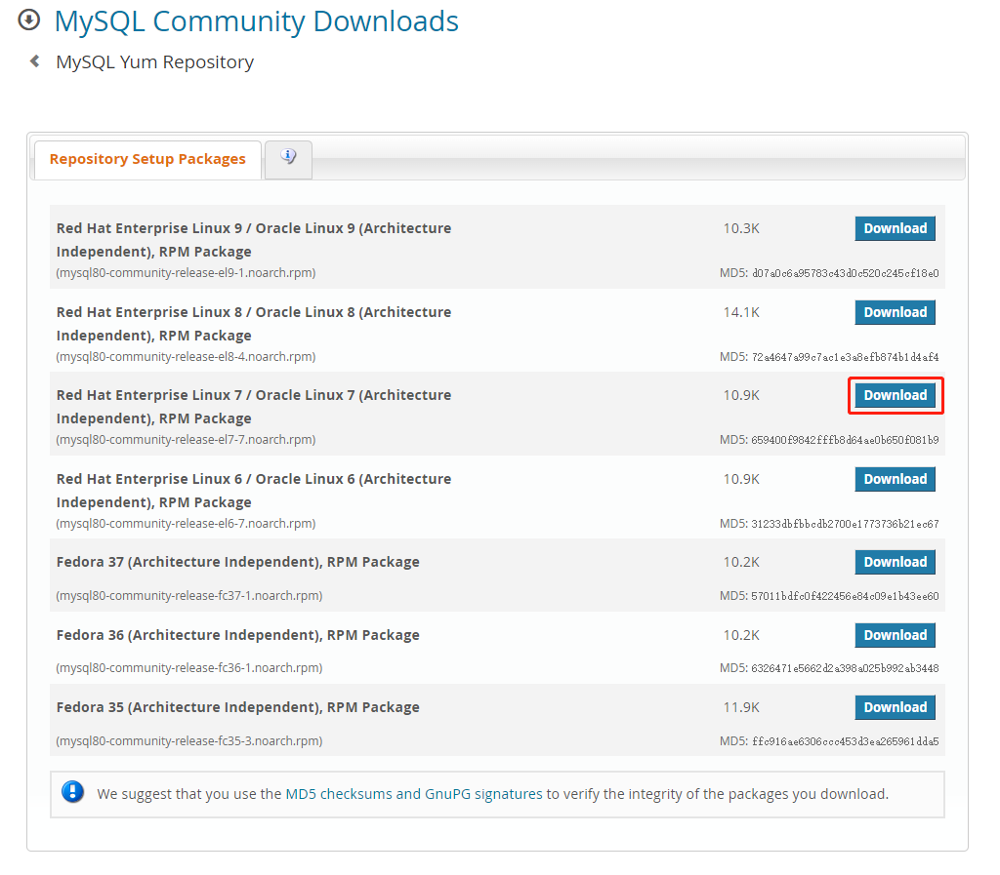
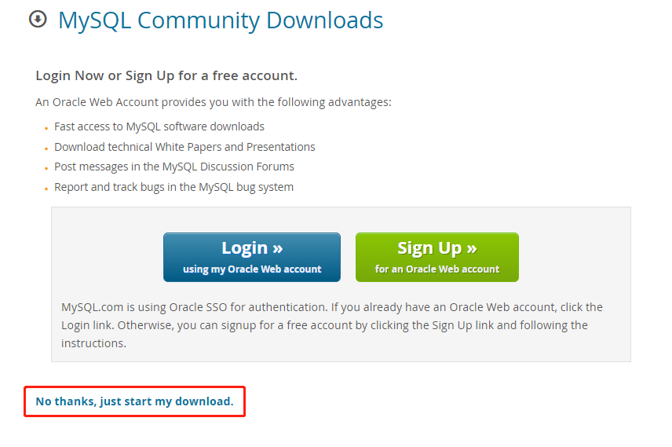

# MySQL

## CentOS

### 在线安装（推荐）

- [安装说明](https://dev.mysql.com/doc/mysql-yum-repo-quick-guide/en/)
- [下载地址](https://dev.mysql.com/downloads/repo/yum/)

#### 1. 查看 CentOS 版本

```shell
cat /etc/centos-release
```

#### 2. 选择合适的 Yum Repository 安装包

例如版本是 CentOS 7 就选择下面这个下载。



跳过登录，直接下载。



这里可以不下载到本地电脑，而是直接复制下载连接，下载到服务器，例如：

```shell
wget https://dev.mysql.com/get/mysql80-community-release-el7-7.noarch.rpm
```

#### 3. 安装 Yum Repository

```shell
rpm -Uvh mysql80-community-release-el7-7.noarch.rpm
```

#### 4. 配置要安装的 MySQL 版本

> 目前默认安装最新 8.0 版本，如果不需要改就跳过这一步。

例如切换到 5.7 版本安装：

```shell
yum-config-manager --disable mysql80-community
yum-config-manager --enable mysql57-community
```

如果找不到 `yum-config-manager` 命令，则可以直接改配置文件 `/etc/yum.repos.d/mysql-community.repo`，将 `enbale` 改为 0 或 1：

```shell
[mysql80-community]
name=MySQL 8.0 Community Server
baseurl=http://repo.mysql.com/yum/mysql-8.0-community/el/6/$basearch/
enabled=1
gpgcheck=1
gpgkey=file:///etc/pki/rpm-gpg/RPM-GPG-KEY-mysql-2022
       file:///etc/pki/rpm-gpg/RPM-GPG-KEY-mysql
```

#### 5. 安装 MySQL

```shell
yum install mysql-community-server
```

#### 6. 启动 MySQL

```shell
systemctl start mysqld
```

查看运行状态：

```shell
systemctl start mysqld
```

#### 7. 修改初始密码

```shell
grep 'temporary password' /var/log/mysqld.log
```

输入初始密码登录：

```shell
mysql -uroot -p
```

修改密码：

```sql
ALTER USER 'root'@'localhost' IDENTIFIED BY '新密码';
```

#### 8. 开启远程访问（可选）

::: warning 注意  
生产环境不要开远程访问，有被攻击的风险。  
:::

```sql
UPDATE mysql.user SET host='%' WHERE user='root';
FLUSH PRIVILEGES;
```

### 离线安装

- [下载地址](https://dev.mysql.com/downloads/mysql/) （选择 `Red Hat Enterprise Linux / Oracle Linux`）

## Windows

- [安装包 下载地址](https://dev.mysql.com/downloads/windows/installer/8.0.html)
- [压缩包 下载地址](https://dev.mysql.com/downloads/mysql/)
