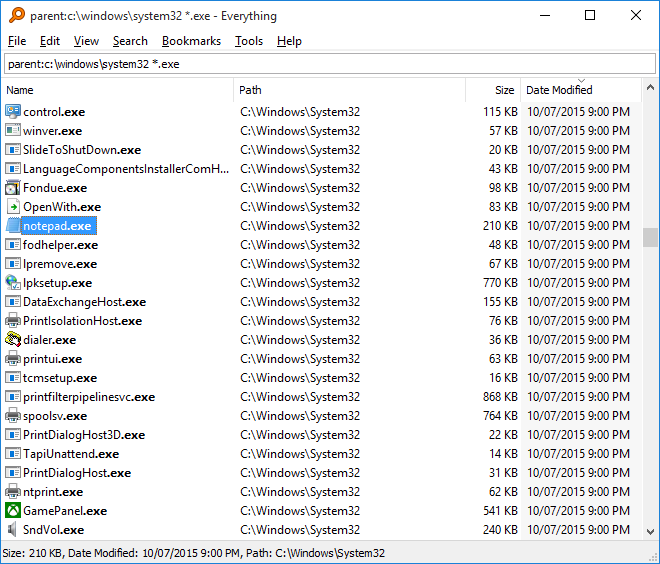
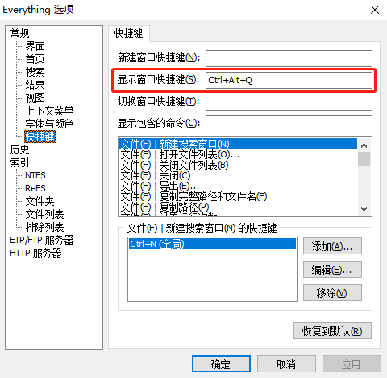
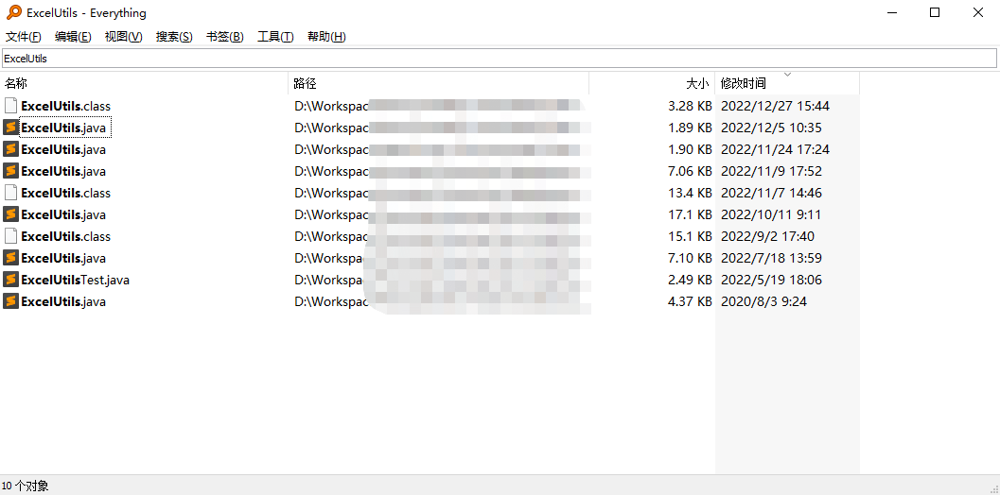
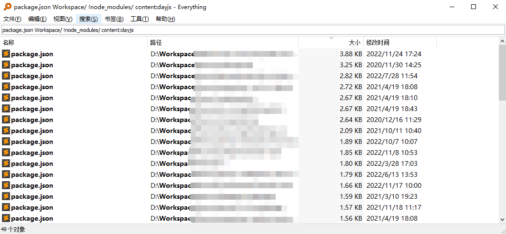
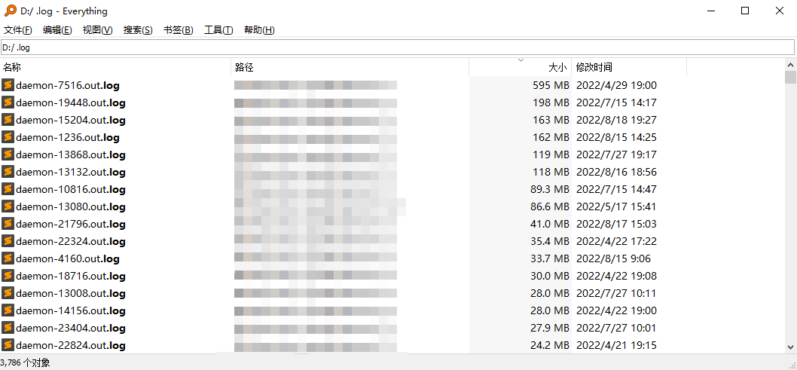

# Everything

> 快速全盘搜索文件路径、名称、内容

[官方网站](https://www.voidtools.com/)

## 使用技巧

### 快捷键设置

### 搜索文件

> 如果有个工具类，想不起来在哪个项目中用过，可以试试用这个搜索。

### 搜索内容

> 查找依赖了某个库的项目也很简单。

### 清理文件

> 如果想清理大文件、日志、编译结果，可以条件搜索全选删除。

