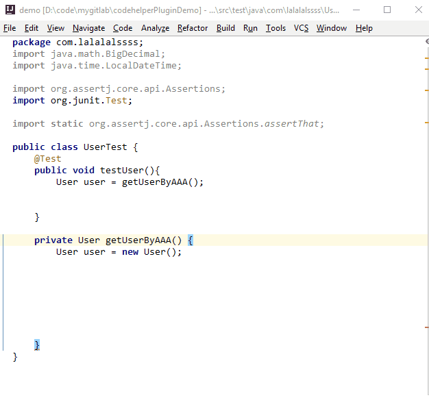
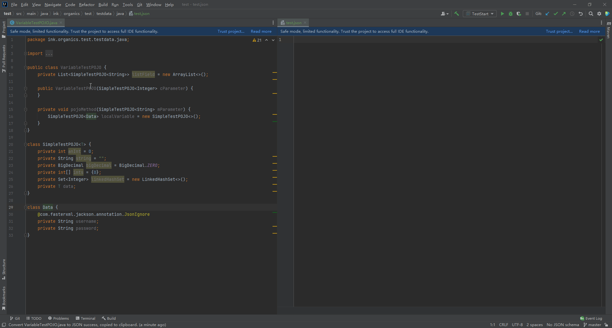
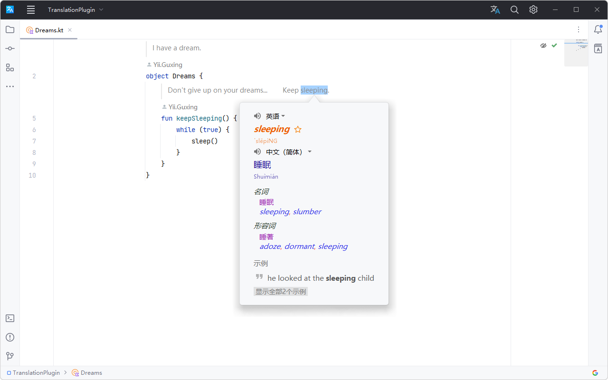

# IntelliJ IDEA

> 开发 Java 应用必备。

## 快捷键

> 以下快捷键提高效率必用，需要全部掌握。

### 搜索

- `Ctrl + E` 最近访问文件
- `Ctrl + Shift + F` 全局搜索内容
- `Ctrl + N` 全局搜索类名
- `Ctrl + Shift + N` 全局搜索文件名
- `Ctrl + G` 跳转行号
- `Ctrl + F12` 跳转方法

### 选择

- `Ctrl + W` 扩大选择范围
- `Alt + J` 选择下一个相同内容
- `Ctrl + Alt + Shift + J` 选择全部相同内容
- `Alt + Up/Down` 上一个/下一个方法
- `鼠标中键长按移动` 多行选择

### 编辑

- `Ctrl + Shift + Enter` 代码补全
- `Ctrl + D` 复制行或选中内容
- `Ctrl + Shift + Up / Down` 上下移动行
- `Ctr + Shift + U` 大小写转换
- `Ctrl + Shift + R` 全局替换

### 重构

- `Shift + F6` 重命名
- `Ctrl + Alt + V` 提取变量
- `Ctrl + Alt + C` 提取常量
- `Ctrl + Alt + M` 提取方法

### 文档

- `Ctrl + Q` 显示文档
- `Ctrl + P` 显示参数列表

### 其它

- `Alt + ~` 版本控制相关功能

## 插件

> 开发中使用插件事半功倍。

### [String Manipulation](https://plugins.jetbrains.com/plugin/2162-string-manipulation)

大小写转换

递增序列

### [GenerateAllSetter](https://plugins.jetbrains.com/plugin/9360-generateallsetter)

批量调用 Setter 方法

### [POJO to JSON](https://plugins.jetbrains.com/plugin/12066-pojo-to-json)

由类生成 JSON 字符串

### [Translation](https://plugins.jetbrains.com/plugin/8579-translation)

翻译文档

